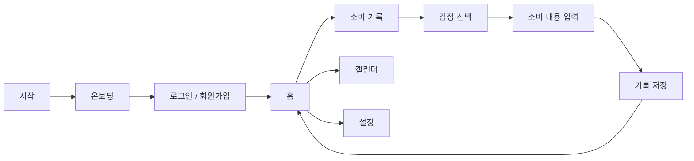
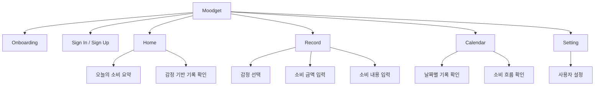
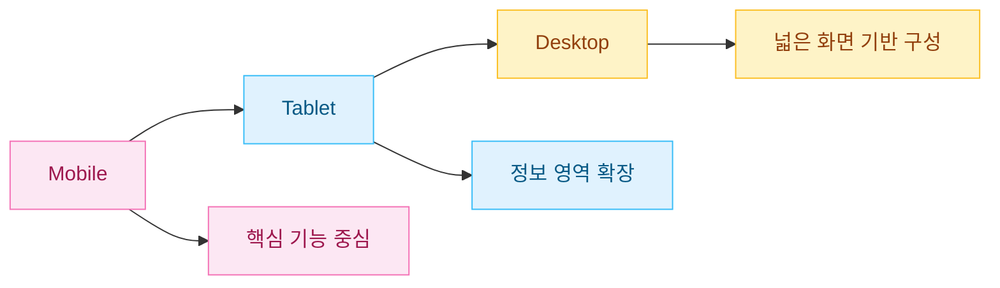
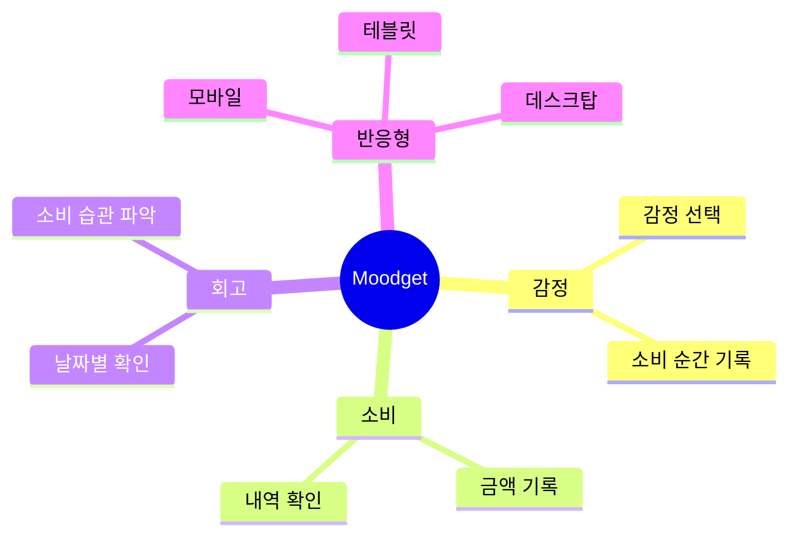
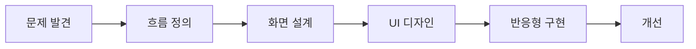

# Moodget

**감정을 기록하고, 소비를 돌아보는 감정 기반 소비 트래킹 서비스**

`감정 기록` `소비 트래킹` `반응형 웹` `UX/UI 디자인` `HTML` `CSS` `JavaScript`

<br/>

## 프로젝트 소개

**Moodget**은 사용자의 소비를 단순히 금액으로만 기록하지 않고,  
그때의 **감정과 함께 기록**할 수 있도록 설계한 감정 기반 소비 트래킹 앱입니다.

소비 내역과 감정을 연결해  
사용자가 자신의 소비 습관을 더 쉽게 이해하고 돌아볼 수 있도록 돕습니다.

<br/>

## 바로가기

| 구분        | 링크                                                     |
| ----------- | -------------------------------------------------------- |
| 배포 페이지 | [Moodget 바로가기](https://hyunjaeha.github.io/moodget/) |
| GitHub      | [Repository](https://github.com/hyunjaeha/moodget)       |

<br/>

## 사용 기술

### Design


### Front-End


<br/>

## 핵심 기능

| 기능           | 설명                              |
| -------------- | --------------------------------- |
| 감정 기반 기록 | 소비할 때의 감정을 함께 기록      |
| 소비 내역 확인 | 날짜별 소비 기록 확인             |
| 캘린더 보기    | 소비 기록을 날짜 흐름에 따라 확인 |
| 반응형 화면    | 모바일 · 테블릿 · 데스크탑 대응   |
| 설정 화면      | 사용자 환경 및 기본 정보 관리     |

<br/>

## 서비스 흐름



<br/>

## 화면 구조



<br/>

## 반응형 구조



<br/>

## 디자인 방향



<br/>

## 프로젝트 구조

```text
moodget
├─ assets/
│  └─ icons/
├─ css/
├─ js/
├─ index.html
├─ onboarding.html
├─ signin.html
├─ signup.html
├─ home.html
├─ record.html
├─ calendar.html
├─ setting.html
└─ README.md
```

<br/>

## 작업 포인트

| 구분        | 내용                                       |
| ----------- | ------------------------------------------ |
| UX          | 감정과 소비를 함께 기록하는 흐름 설계      |
| UI          | 부드럽고 직관적인 기록 화면 구성           |
| Responsive  | 모바일, 테블릿, 데스크탑 화면 대응         |
| Interaction | 소비 기록 과정의 사용 흐름 구현            |
| Visual      | 감정 기반 서비스에 맞는 친근한 분위기 구성 |

<br/>

## 디자인 프로세스



<br/>

## 기대 효과

| Before                     | After                                  |
| -------------------------- | -------------------------------------- |
| 금액 중심의 단순 소비 기록 | 감정과 함께 소비를 돌아보는 기록       |
| 소비 이유 파악이 어려움    | 감정과 소비 패턴을 함께 확인           |
| 모바일 중심 화면           | 모바일 · 테블릿 · 데스크탑 반응형 대응 |

<br/>

## 프로젝트 의미

Moodget은 소비를 단순한 숫자가 아닌  
**감정과 연결된 경험**으로 바라본 프로젝트입니다.

사용자가 자신의 소비를 더 쉽게 이해하고,  
스스로의 소비 습관을 돌아볼 수 있는 서비스를 목표로 제작했습니다.
